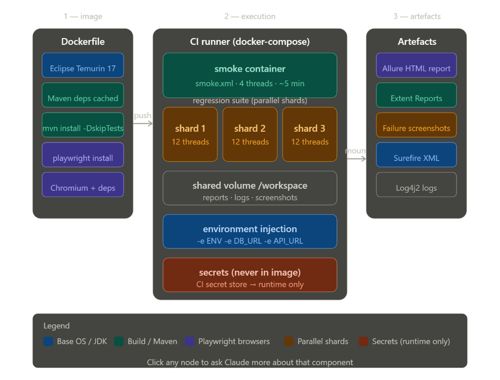

# Test Automation Framework

A comprehensive three-layered test automation framework built with Java, Playwright, REST Assured, and support for multiple databases (Oracle, MS SQL, MySQL, PostgreSQL).

## Framework Architecture

### Layer 1: Core Framework (`core-framework`)
The foundation layer containing reusable components:
- **Playwright Management**: Browser automation setup and management
- **REST Assured Client**: API testing capabilities
- **Database Manager**: Multi-database connectivity (Oracle, MS SQL, MySQL, PostgreSQL)
- **Configuration Manager**: Environment-based configuration handling
- **Reporting**: Extent Reports and Allure integration
- **Base Test Classes**: Common test setup and teardown
- **Utilities**: Helper classes and common functions

### Layer 2: Application Automation (`application-automation`)
Application-specific automation layer:
- **Page Objects**: Playwright-based page object models
- **API Clients**: REST Assured API client implementations
- **Database Helpers**: Application-specific database queries
- **Business Logic**: Reusable workflows and actions

### Layer 3: Application Tests (`application-tests`)
Test scenarios and test cases:
- **UI Tests**: Playwright-based UI test cases
- **API Tests**: REST Assured API test cases
- **Database Tests**: Database validation test cases
- **Integration Tests**: End-to-end scenarios combining UI, API, and Database

## Prerequisites

- **Java**: JDK 17 or higher
- **Maven**: 3.8.0 or higher
- **Browsers**: Chromium, Firefox, or WebKit (auto-installed by Playwright)
- **Database Drivers**: Included in dependencies

## Project Structure

```
test-automation-framework/
├── core-framework/                  # Layer 1: Core Framework
│   ├── src/main/java/
│   │   └── com/smbc/raft/core/
│   │       ├── config/              # Configuration management
│   │       ├── database/            # Database connectivity
│   │       ├── playwright/          # Playwright management
│   │       ├── api/                 # REST Assured client
│   │       ├── reporting/           # Test reporting
│   │       ├── utils/               # Utilities and base classes
│   │       └── exceptions/          # Custom exceptions
│   ├── src/main/resources/
│   │   ├── config/                  # Configuration files
│   │   └── log4j2.xml              # Logging configuration
│   └── src/test/java/               # Core Framework tests
│
├── application-automation/          # Layer 2: Application Automation
│   └── src/main/java/
│       └── com/smbc/raft/app/
│           ├── pages/               # Page Objects
│           ├── api/                 # API Clients
│           └── database/            # Database Helpers
│
├── application-tests/               # Layer 3: Test Cases
│   ├── src/test/java/
│   │   └── com/smbc/raft/tests/
│   │       ├── ui/                  # UI test cases
│   │       ├── api/                 # API test cases
│   │       ├── database/            # Database test cases
│   │       └── integration/         # Integration test cases
│   └── src/test/resources/
│       └── testng.xml               # TestNG suite configuration
│
└── pom.xml                          # Parent POM
```

## Setup Instructions

### 1. Clone the Repository
```bash
git clone <repository-url>
cd test-automation-framework
```

### 2. Install Dependencies
```bash
# Build all modules and install to local .m2 repository
mvn clean install -DskipTests
```

### 3. Install Playwright Browsers
```bash
mvn exec:java -e -D exec.mainClass=com.microsoft.playwright.CLI -D exec.args="install"
```

### 4. Configure Environment

Edit the configuration files in `core-framework/src/main/resources/config/`:

- `browser`: chromium | firefox | webkit
- `headless`: true | false
- `timeout`: Global Playwright timeout (ms)
- `test.timeout.ms`: Individual TestNG test method timeout (ms)

## Running Tests

### Standard Execution
```bash
mvn test -pl application-tests -Denv=qa
```

### Dynamic Sharding (Horizontal Scaling)
The framework supports dynamic, runtime sharding. You can split a single TestNG suite across multiple processes/containers without modifying XML files:

```bash
# Run first half of the tests
mvn test -DshardIndex=0 -DshardTotal=2

# Run second half of the tests
mvn test -DshardIndex=1 -DshardTotal=2
```

### Docker Sharding
For large regression suites, use the provided shard runner to spin up parallel containers:

```bash
# On Unix
./bin/shard-runner.sh

# On Windows
./bin/shard-runner.ps1
```
This utilizes `docker-compose.shards.yml` to orchestrate multiple test instances contributing to a shared report volume.

## Resource Optimization
- **Browser Pooling**: The framework maintains a `BrowserPool` that reuses the heavy browser process across tests within a thread. Each test receives a lightweight, isolated `BrowserContext`.
- **JVM Fork Reuse**: Configured in `pom.xml` via `reuseForks=true` to minimize JVM startup overhead.
- **Parallel Execution**: Enabled at the method level by default in `testng.xml`.

## Security & Credentials
The framework implements enterprise-grade security features to protect sensitive data:
- **Secret Management**: Decouple credentials from code using `${VAR}` placeholders.
- **Dynamic Resolution**: Automatic lookup from Environment Variables and System Properties.
- **Log Masking**: Sensitive database URLs and passwords are automatically masked in logs.
- **SSL/TLS Support**: Built-in support for self-signed certificates and custom TrustStores.

For detailed instructions, see [SECURITY.md](SECURITY.md).

## Running Tests

### Run All Tests
```bash
mvn clean test
```

### Run Specific Test Suite
```bash
mvn clean test -DsuiteXmlFile=src/test/resources/testng.xml
```

### Run with Specific Environment
```bash
mvn clean test -Denv=qa
```

### Run in Headless Mode
```bash
mvn clean test -Dheadless=true
```

### Run Specific Test Class
```bash
mvn clean test -Dtest=LoginTest
```

### Run with Different Browser
```bash
mvn clean test -Dbrowser=firefox
```

## Database Configuration

### Oracle Database
```properties
db.type=oracle
db.url=jdbc:oracle:thin:@hostname:1521:database
db.username=username
db.password=password
```

### MS SQL Server
```properties
db.type=mssql
db.url=jdbc:sqlserver://hostname:1433;databaseName=dbname
db.username=username
db.password=password
```

### MySQL
```properties
db.type=mysql
db.url=jdbc:mysql://hostname:3306/database
db.username=username
db.password=password
```

### PostgreSQL
```properties
db.type=postgresql
db.url=jdbc:postgresql://hostname:5432/database
db.username=username
db.password=password
```

### Multiple Database Connections
```properties
# Primary database (Oracle)
db.type=oracle
db.url=jdbc:oracle:thin:@primary-server:1521:primarydb
db.username=primary_user
db.password=primary_pass

# Secondary database (MS SQL)
db.secondary.type=mssql
db.secondary.url=jdbc:sqlserver://secondary-server:1433;databaseName=secondarydb
db.secondary.username=secondary_user
db.secondary.password=secondary_pass
```

## Test Reports

### Extent Reports
Reports are generated in: `test-output/extent-reports/`

Features:
- HTML dashboard with test results
- Screenshots on failure
- Test categorization
- Execution timeline

### Allure Reports
Generate Allure reports:
```bash
mvn allure:serve
```

## Key Features

### 1. Multi-Browser Support
- Chromium (Chrome/Edge)
- Firefox
- WebKit (Safari)

### 2. API Testing
- REST Assured integration
- Request/Response validation
- Authentication support
- JSON/XML handling

### 3. Database Testing
- Multiple database support
- Connection pooling
- Parameterized queries
- Transaction management

### 4. Reporting
- Extent Reports
- Allure Reports
- Screenshot capture
- Detailed logging

### 5. Parallel Execution
- TestNG parallel execution
- Thread-safe implementation
- Configurable thread count

### 6. Data Handling
- Excel (.xlsx) read/write operations
- CSV read/write operations
- Data-driven testing with TestNG DataProviders
- Test data management
- Result export capabilities

### 7. Configuration Management
- Environment-based configuration
- Property file hierarchy
- System property override

## Docker Execution Architecture

The framework is fully containerized to ensure consistent execution across local development and CI/CD environments.



### Container Strategy
*   **Multi-Stage Build**: Optimized `Dockerfile` that caches Maven dependencies and provides a lean runtime environment with all Playwright system dependencies.
*   **Headless Execution**: Pre-configured for headless Chromium runs in Linux-based containers.
*   **Parallel Sharding**: Support for sharded execution via Docker Compose to scale regression suites across multiple containers.
*   **Security**: Integrated environment variable interpolation for secure credential management (secrets never baked into the image).

### Quick Start with Docker
```bash
# Build the automation image
docker build -t test-automation:latest .

# Run the smoke suite against QA
docker run --rm \
  -v $(pwd)/workspace:/workspace \
  -e ENV=qa \
  -e DB_PASSWORD=your_password \
  test-automation:latest
```

## Writing Tests

### UI Test Example
```java
public class MyUITest extends BaseTest {
    private LoginPage loginPage;
    
    @BeforeMethod
    public void setup() {
        PlaywrightManager.initializeBrowser();
        loginPage = new LoginPage();
    }
    
    @Test
    public void testLogin() {
        loginPage.navigateToLoginPage("https://example.com");
        loginPage.login("user@example.com", "password");
        Assert.assertTrue(new HomePage().isHomePageLoaded());
    }
}
```

### API Test Example
```java
public class MyApiTest extends BaseTest {
    private UserApiClient userApi;
    
    @BeforeClass
    public void setupClass() {
        userApi = new UserApiClient();
    }
    
    @Test
    public void testGetUser() {
        Response response = userApi.getUserById(1);
        Assert.assertEquals(response.getStatusCode(), 200);
    }
}
```

### Database Test Example
```java
public class MyDatabaseTest extends BaseTest {
    private UserDatabaseHelper userDb;
    
    @BeforeClass
    public void setupClass() {
        userDb = new UserDatabaseHelper();
    }
    
    @Test
    public void testUserExists() {
        boolean exists = userDb.userExists(1);
        Assert.assertTrue(exists);
    }
}
```

## Best Practices

1. **Use Page Object Model**: Keep locators and actions in page objects
2. **Data-Driven Testing**: Externalize test data
3. **Meaningful Assertions**: Use descriptive assertion messages
4. **Clean Test Data**: Clean up test data in @AfterClass or @AfterMethod
5. **Logging**: Use ExtentReportManager for test documentation
6. **Wait Strategies**: Use explicit waits instead of Thread.sleep()
7. **Independence**: Keep tests independent and idempotent

## Troubleshooting

### Browser Not Launching
```bash
mvn exec:java -e -D exec.mainClass=com.microsoft.playwright.CLI -D exec.args="install"
```

### Database Connection Issues
- Verify database is running
- Check connection string format
- Verify credentials
- Ensure database driver is included

### Test Execution Issues
- Check Java version (requires JDK 17+)
- Verify Maven version (3.8.0+)
- Clear Maven cache: `mvn clean`
- Check TestNG XML configuration

## Contributing

1. Follow the three-layer architecture
2. Write clean, maintainable code
3. Add Javadoc comments
4. Include unit tests for utilities
5. Update documentation

## Support

For issues and questions:
- Check documentation
- Review example tests
- Consult framework logs in `test-output/logs/`

## License

[Your License Here]
## Maven Commands & Usage Guide

### Build and Installation
- **Full Build (Skip Tests)**: `mvn clean install -DskipTests`
- **Build Single Module**: `mvn clean install -pl core-framework`
- **Update Dependencies**: `mvn clean install -U`

### Quality Gates (Checkstyle, Enforcer, SpotBugs)
- **Run All Quality Checks**: `mvn validate` (runs on all modules)
- **Check Specific Module**: `mvn validate -pl core-framework`
- **Run Only Checkstyle**: `mvn checkstyle:check -pl core-framework`
- **Run Only Enforcer**: `mvn enforcer:enforce -pl core-framework`
- **Skip Quality Checks**: `mvn clean verify -Dskip.quality=true`

### Test Execution
- **Run Smoke Tests**: `mvn test -Dcucumber.filter.tags="@smoke"`
- **Run Specific Environment**: `mvn test -Denv=qa -Dprofile=local`
- **Run Specific Suite**: `mvn test -DsuiteXmlFile=src/test/resources/testng.xml`
- **Run Individual Test**: `mvn test -Dtest=CSVDataHandlingTest`

### Dependency Management
- **View Dependency Tree**: `mvn dependency:tree`
- **Check for Updates**: `mvn versions:display-dependency-updates`
- **Analyze Dependencies**: `mvn dependency:analyze`

### Troubleshooting
- **Debug Mode**: `mvn <command> -X`
- **Effective POM**: `mvn help:effective-pom`
- **Display Properties**: `mvn help:evaluate -Dexpression=project.properties`
